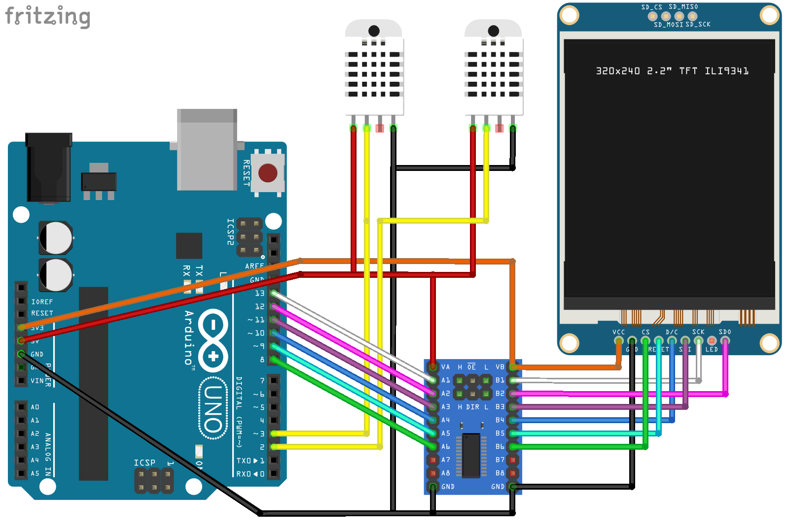

# termometr.ino

An Arduino-based thermometer utilising DHT22 temperature sensors and an ILI9341 display.

This README gives a quick rundown of the project. If you want some more information,
check out the [post on my blog](https://blog.svgames.pl/article/setting-up-an-adruino-and-dht22-weather-station).

## Required components

- An Arduino UNO (or a compatible knock-off)

- Two DHT22 sensors (work on 5V)

- An ILI9341 display (works on 3.3V)

- A six- (or more) channel logic converter (for wiring up the display)

## Wiring

The display is connected to the Arduino through the logic-level converter.
There are six pins being used on the UNO; the three hardware SPI pins: #13 (SCK), #12 (MISO), #11 (MOSI)
are forced on us by the way the Adafruit ILI9341 library is written. The other three
pins can be freely chosen, so I decided to go with #10 (DC), #9 (RESET) and #8 (CS) simply
to keep things close together.

The temperature sensors use pins #2 and #3 on the UNO, mostly because I wanted to keep distance from the pins
used for communicating with the display.

## Uploading to your Arduino

1. Connect your Arduino UNO to your PC.

2. Launch the Arduino IDE and open the `termometr.ino` file.

3. Install the dependencies by opening the Library Manager. You're going to need the following:
  
  - "DHT sensor library" by Adafruit
  
  - "Adafruit ILI9341" by Adafruit
  
  - "Adafruit GFX library" by Adafruit

4. Use the IDE's "Upload" button to compile the software and upload it to your Arduino.

## Licence

This software is made available under the terms of the GNU General Public License, version 3,
as published by the Free Software Foundation.
